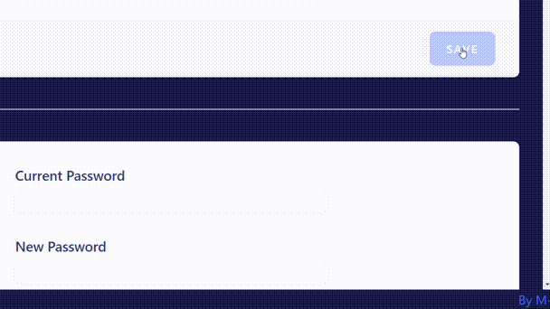

# Add a flash message (Vue2)

Shows a flash message from props or from vue bus. With the bus any element in any place can send a flash message. The
type of message can be sent too with props or bus. It can be 'info'(by default), 'error' or 'warning', changing the
messages's color.

**Bus only works with Vue2!**

## Usage with props

~~~
<template>
    ...
    <flash-message :message="flashMessage" [:msgType="type"] />
    ...
</template>

<script>
    import FlashMessage from "../components/FlashMessage";
    export default {
        components: {
            FlashMessage,
        },
        data() {
            return {
                flashMessage: '',
                [type: 'info',]
            }
        },
~~~

where code inside [] is optional.

## Usage with bus (Vue2)

~~~
<template>
    ...
</template>

<script>
    import import { bus } from '../../app';
  
    export default {
        methods: {
            sendInfoFlash(){
                bus.$emit('flash','Profile updated.');
            }
            sendErrorFlash(){
                bus.$emit('flash','Profile not updated.','error');
            }
~~~

### Config

(in Laravel, in resources/js/app.js)

~~~
import Vue from 'vue';
...
export const bus = new Vue();

new Vue({
    ...

~~~
